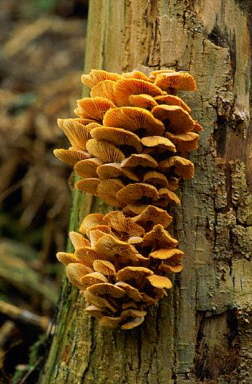

```{r, include = FALSE}
knitr::opts_chunk$set(
collapse = TRUE,
comment = "#>"
)
load('allRes_TreeFungi.rda')
```

{width="30%" fig-align="center"}

### Requirements

This tutorial follows the one on `sbm`. As before, we will need the package `sbm` package, along with some additional packages for data manipulation and visualization:

```{r setup, message=FALSE, warning=FALSE}
#| code-fold: false
library(sbm)
library(ggplot2)
library(knitr)
library(patchwork)
library(mclust)
```

## 1. An antagonistic tree/fungus interaction network

We consider the fungus-tree interaction network studied by @tree_fungus_network, available with the package `sbm` :

This data set provides information about $154$ fungi sampled on $51$ tree species. It is a list with the following entries:

-   `tree_names` : list of the tree species names
-   `fungus_names`: list of the fungus species names
-   `tree_tree` : weighted tree-tree interactions: number of common fungal species two tree species host.
-   `fungus_tree` : binary fungus-tree interactions
-   `covar_tree` : covariates associated to pairs of trees (namely genetic, taxonomic and geographic distances)

```{r import dataset}
#| code-fold: false
data("fungusTreeNetwork")
str(fungusTreeNetwork,  max.level = 1)
```

In what follows, we will first consider the simple tree-tree network in its binary and weighted versions. Then we will consider the bipartite network between trees and fungi.

# 2. Analysis of the binary 🌳–🌲 network.

## 2.1 The data

We first consider the binary network where an edge is drawn between two trees when they do share a least one common fungi:

```{r tree_tree_binary network}
#| code-fold: false
tree_tree_binary <- 1 * (fungusTreeNetwork$tree_tree != 0)
```

The function `plotMyMatrix` can be used to represent simple or bipartite SBM:

```{r tree_tree_binary network plot data}
plotMyMatrix(tree_tree_binary, dimLabels = list(row = 'tree', col = 'tree'))
```

## 2.2 The model

We look for some latent organization of the network by adjusting a simple SBM with the function `estimateSimpleSBM`. We assume the our matrix is the realization of the SBM model.

::: callout-note
The SBM model is defined as: \begin{align*}
 (Z_i) \text{ i.i.d.} \qquad & Z_i \sim \mathcal{M}_K(1, \pi) \\
 (Y_{ij}) \text{ indep.} \mid (Z_i) \qquad & (Y_{ij} \mid Z_i=k, Z_j = \ell) \sim \mathcal{B}(\alpha_{k\ell})
\end{align*}
:::

The function \code{estimateSimpleSBM} from `sbm` package (based on the package : `blockmodels`) infers this model with Variational EM. Note that `simpleSBM` refers to standard networks (w.r.t. bipartite).

## 2.3 Fitting the Bernoulli-SBM

We apply the VEM and ICL criterion to infer the structure of the network.

```{r simpleSBM print,eval =FALSE, echo = TRUE}
#| code-fold: false
mySimpleSBM <- tree_tree_binary %>%
  estimateSimpleSBM("bernoulli", directed= FALSE,
                    dimLabels ='tree', 
                    estimOptions = list(verbosity = 0, plot=FALSE))
```

We can plot the ICL with respect to $K$ as follows.

```{r binary ICL}
#| code-fold: false
mySimpleSBM$storedModels %>%  
  ggplot() + 
  aes(x = nbBlocks, y = ICL) + geom_line() + geom_point(alpha = 0.5) + geom_vline(xintercept = mySimpleSBM$storedModels$nbBlocks[which.max(mySimpleSBM$storedModels$ICL)],color = "red")
```

We obtain `r mySimpleSBM$nbBlocks` blocks. We can now plot the reordered matrix.

```{r simpleSBMfit plot1}
#| code-fold: false
p1 <- plot(mySimpleSBM, type = "data", dimLabels = list(row = 'tree', col = 'tree'))
p2 <- plot(mySimpleSBM, type = "expected", dimLabels = list(row = 'tree', col = 'tree'))
p1 | p2

```

# 3. Analysis of the weighted 🌳–🌲 network

Instead of considering the binary network tree-tree we may consider the weighted network where the link between two trees is the number of fungi they share.

We plot the matrix with function `plotMyMatrix`:

```{r tree_tree network plot data}
#| code-fold: false
tree_tree <- fungusTreeNetwork$tree_tree
plotMyMatrix(tree_tree, dimLabels = list(row = 'tree', col = 'tree'))
```

Here again, we look for some latent structure of the network by adjusting a simple SBM with the function `estimateSimpleSBM`, considering a Poisson distribution on the edges.

::: callout-note
The Poisson-SBM model is: \begin{align*}
 (Z_i) \text{ i.i.d.} \qquad & Z_i \sim \mathcal{M}_K(1, \pi) \\
 (Y_{ij}) \text{ indep.} \mid (Z_i) \qquad & (Y_{ij} \mid Z_i=k, Z_j = \ell) \sim \mathcal{P}(\exp(\alpha_{kl})) = \mathcal{P}(\lambda_{kl})
\end{align*}
:::

```{r simpleSBM Poisson, eval   = FALSE, echo = TRUE}
#| code-fold: false
mySimpleSBMPoisson <- tree_tree %>%
  estimateSimpleSBM("poisson", 
                    directed = FALSE,
                    estimOptions = list(verbosity = 2 , plot = TRUE),
                    dimLabels = c('tree'))
```

We now plot the matrix reordered according to the memberships estimated in the SBM. Once again, one can also plot the expected network which, in case of the Poisson model, corresponds to the expected weight of connections between any pair of nodes in the network.

```{r simpleSBMfitPoisson plot1}
#| code-fold: false
plot(mySimpleSBMPoisson, type = "data") | plot(mySimpleSBMPoisson, type = "expected")
```

The composition of the clusters/blocks can be displayed by now be scrutined.

```{r list names blocks Poisson,  echo=TRUE, eval = TRUE}
#| code-summary: 'Cluster composition'
#| 
#------------------------------------------- 
print_cluster = function(Z,names_Z){
  names(Z) = sub("\\(.*", "", names_Z) # short tree species names
  Z <- sort(Z)
  K <- max(Z)
  clusters <- lapply(1:K,function(k){names(Z)[Z==k]})
  max_len <- max(sapply(clusters, length))
  df <- sapply(clusters, function(x) c(x, rep('', max_len - length(x)))) %>% as.data.frame()
  names(df) <- paste('Cluster',1:K)
  return(df)
}
df <- print_cluster(mySimpleSBMPoisson$memberships, fungusTreeNetwork$tree_names)
knitr::kable(df, caption = "Tree Clusters")

```

We are interested in comparing the two clusterings. To do so we use the alluvial flow plots and compute the ARI .

```{r alluvial, echo=TRUE,eval=TRUE}
#| code-fold: false
listMemberships <- list(Binary = mySimpleSBM$memberships)
listMemberships$Weighted <- mySimpleSBMPoisson$memberships
ARI <- adjustedRandIndex(mySimpleSBM$memberships, mySimpleSBMPoisson$memberships)
P <- plotAlluvial(listMemberships)
```

# 4. Poisson SBM with covariates

We have on each pair of trees 3 covariates, namely the genetic distance, the taxonomic distance and the geographic distance. Each covariate has to be introduced as a matrix: $X^k_{ij}$ corresponds to the value of the $k$-th covariate describing the couple $(i,j)$.

We can also use the `sbm` package to estimate the parameters of the SBM with covariates.

::: callout-note
THE SBM with covariates is: \begin{align*}
 (Z_i) \text{ i.i.d.} \qquad & Z_i \sim \mathcal{M}(1, \pi) \\
 (Y_{ij}) \text{ indep.} \mid (Z_i) \qquad & (Y_{ij} \mid Z_i=k, Z_j = \ell) \sim \mathcal{P}(\exp(\alpha_{kl} + x_{ij}^\intercal \theta)) = \mathcal{P}(\lambda_{kl}\exp(x_{ij}^\intercal \theta))
\end{align*}
:::

```{r covar SBM,echo= TRUE,eval= FALSE}
#| code-fold: false
mySimpleSBMCov<- estimateSimpleSBM(
  netMat = as.matrix(tree_tree),
  model = 'poisson',
  directed =FALSE,
  dimLabels =c('tree'), 
  covariates  = fungusTreeNetwork$covar_tree,
  estimOptions = list(verbosity = 2,plot=TRUE))
```

```{r cov ICL}
mySimpleSBMCov$storedModels %>%  
  ggplot() + 
  aes(x = nbBlocks, y = ICL) + geom_line() + geom_point(alpha = 0.5) + geom_vline(xintercept = mySimpleSBMCov$storedModels$nbBlocks[which.max(mySimpleSBMCov$storedModels$ICL)],color = "red")
```

We now obtain `r mySimpleSBMCov$nbBlocks` blocks, which is less than before. As a consequence, the covariates do explain a part of the structure. They do not explain all the structure because $K$ is still greater tant $1$.

We can now extract the parameters of interest, namely the block proportions and the effect of the covariates.

```{r extract param SBM poisson covar, echo=TRUE, eval = TRUE}
#| code-fold: false
mySimpleSBMCov$blockProp
mySimpleSBMCov$covarParam
```

We could perform a selection of the covariates by estimating the model with a subset of the complete covariate set.

```{r covar SBM2,echo= TRUE,eval= FALSE}
#| code-fold: false
mySimpleSBMCov2<- estimateSimpleSBM(
  netMat = as.matrix(tree_tree),
  model = 'poisson',
  directed =FALSE,
  dimLabels =c('tree'), 
  covariates  = fungusTreeNetwork$covar_tree[-1],
  estimOptions = list(verbosity = 0,plot=FALSE))
mySimpleSBMCov2$ICL - mySimpleSBMCov$ICL
```

In this case, `mySimpleSBMCov2$ICL - mySimpleSBMCov$ICL >0` so the model without the genetic distance is prefered.

::: callout-tip
Note that the clusters do not play the same role anymore. They do not encode the structure of the network by only the residual structure after the covariates have been taking into account. As a consequence, they are difficult to interpret. Reordering the matrix with respect to this clustering may not highlight structures as clear as before.
:::

```{r plot  cov, echo=TRUE,eval=FALSE}
plot(mySimpleSBMCov)
```

# 5. Analysis of the 🌳-🍄 network

Finally, we go back to the original data and analyze the bipartite tree/fungi interactions. The incidence matrix can be plotted with the function \code{plotMyMatrix}

```{r plot incidence}
biAdj <-  fungusTreeNetwork$fungus_tree
colnames(biAdj) <- sub("\\(.*", "",fungusTreeNetwork$tree_names)
row.names(biAdj) <- sub("\\(.*", "",fungusTreeNetwork$fungus_names)
plotMyMatrix(t(biAdj), dimLabels=list(col = 'fungis',row = 'tree'),plotOptions = list(colNames=TRUE, rowNames=TRUE))+ theme(
    axis.text = element_text(size = 3)
  )
```

::: callout-note
THE SBM adapted to bipartite network is: \begin{align*}
 (Z_i) \text{ i.i.d.} \qquad & Z_i \sim \mathcal{M}_K(1, \pi) \\
  (W_j) \text{ i.i.d.} \qquad & W_j \sim \mathcal{M}_L(1, \rho) \\

 (Y_{ij}) \text{ indep.} \mid (Z_i, W_j) \qquad & (Y_{ij} \mid Z_i=k, W_j = \ell) \sim \mathcal{B}(\alpha_{k\ell})
\end{align*}
:::

```{r tree_fungi_bipartite network, eval = FALSE, echo = TRUE}
#| code-fold: false
myBipartiteSBM <- estimateBipartiteSBM(
  netMat = as.matrix(fungusTreeNetwork$fungus_tree),
  model = 'bernoulli',
  dimLabels=c(row = 'fungis',col = 'tree'),
  estimOptions = list(verbosity = 1,plot = TRUE))
```

We can now plot the reorganized matrix.

```{r plot bipartite estim}
plot(myBipartiteSBM, type = "data") | plot(myBipartiteSBM, type = "expected")
```

::: callout-note
An interesting structure emerges: block 2 of trees interacts primarily with fungal blocks 2 and 4, whereas tree blocks 1 and 3 mainly interact with fungal blocks 1 and 2. Tree block 4 consists of species associated with relatively few fungal partners.
:::

The clusters of the trees are now:

```{r list names blocks tree Bipartite,  echo=FALSE, eval = TRUE}
#| code-summary: 'Cluster composition'
df <- print_cluster(myBipartiteSBM$memberships$tree, fungusTreeNetwork$tree_names)
knitr::kable(df, caption = "Tree Clusters")
```

The clusters of the fungi are now:

```{r list names blocks fungis Bipartite,  echo=FALSE, eval = TRUE}
#| code-summary: 'Cluster composition'
df <- print_cluster(myBipartiteSBM$memberships$fungis, fungusTreeNetwork$fungus_names)
knitr::kable(df, caption = "Fungi clusters")
```

# 6. To go further 


Consider your preferred foodweb or plant-pollinator network (or the one from Day 2). Apply the sbm inference and compare the clusters to the ones introduced on Day 2. 


```{r trophic}

``` 

# References
